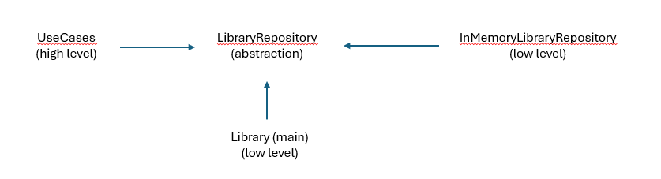

# How SOLID principles are applied

## S: Single Responsibility Principle

A class should have only one reason to change which means One class = One responsibility.  
In the GalwayLibrary project each class handles one responsibility. The entity classes handle creation of the Member, Book entity while the BorrowRecord class handle the junction entity arising from the many to many entity relationships. They only know how to change their states but does not know anything about the user interface menu or database ArrayList.  

Use Cases like AddBookUseCase, RegisterMemberUseCase each handle a single logic or responsibility defining what the program does:  

AddBookUseCase: adds a book to the library  
RegisterMemberUseCase: register a library member.  
BorrowBookUseCase: execute borrowing of book.  
ReturnBookUseCase: handles return of a book.  
ListBooksUseCase: list all books in library.  
ListMembersUseCase: list all library members.  
SearchBookUseCase: search for a book using book id.  
The InMemoryLibraryRepository acts as the framework for data List handling implementing all the abstract methods of the LibraryRepository class.  
While the Library class runs the program on the command line interface for the user

## O: Open/Closed Principle

Open/Closed Principle states that Classes should be open for extension and closed for modification. In the GalwayLibrary program the use cases do not care about how the data is stored but only on the method they can call for example:

    void addBook(Book book);
    Book findBookById(String bookId);
    void addMember(Member member);
    Member findMemberById(int memberId);
    void addBorrowRecord(BorrowRecord record);
    BorrowRecord getBorrowRecords(String bookId);

And these methods are declared in the LibraryRepository interface which itself is an abstraction not the core memory implementation and if later we want to do something like add a web API or use a file-based repository we can implement this without changing the use cases thus we can extend but we are closed to modifications.

## L: Liskov Substitution Principle

Subtypes must be substitutable for their base types – hierarchy shouldn’t be broken. In our case the InMemoryLibraryRepository can be substituted with another implementation of database management like MySQL and the program will still run perfectly because the use case relies on the abstract methods defined in the interface and any new substituted class has to implement these contracts.

## I: Interface Segregation Principle

Clients should not be forced to depend on interfaces they do not use.  
We had the LibraryRepository define focused operations breaking them down to operations based on books, members and borrow record such that the use cases only call methods that they need and not what they do not need. Example: the searchBookUseCase only uses the finBookById(String bookId) method and is not forced to use the getAllBooks() method

## D: Dependency Inversion Principle

High-level modules should not depend on low-level modules. Both should depend on abstractions.
In our code this rule is enforced by having both the InMemoryLibraryRepository and Library module which are both low-level modules be dependent on the higher abstraction the LibraryRipository and have all the Use cases which are high level modules and contain the logic of how the library should function be connected to them through the abstraction level


 
Example in the ListBookUseCase below the request is to codes that implement the LibraryRepository and there is no mention or import of the InMemeoryLibraryRepository.
```
package usecases;

import adapters.LibraryRepository;
import entities.Book;
import java.util.List;

public class ListBooksUseCase {

    private final LibraryRepository libraryRepository;

    public ListBooksUseCase(LibraryRepository libraryRepository) {
        this.libraryRepository = libraryRepository;
    }

    public void execute() {
        List<Book> books = libraryRepository.getAllBooks();
        for (Book book : books) {
            System.out.println(book);
        }
    }
}
```
and in the framework the InMemeoryLibraryRepository implements the LibraryRepository forcing it to follow the abstraction:
```
public class InMemoryLibraryRepository implements LibraryRepository {...}
```

## Clean Architecture mapping and each code components mapped in a table

| Clean Architecture Layer | What it means | Library System Mapping | Concrete Examples in This Project |
|--------------------------|--------------|------------------------|------------------------------------|
| Entities | Core concepts and business rules that remain stable even if technology changes | Objects that define the library domain | Book, Member, BorrowRecord, BookStatus |
| Use Cases | Application-specific workflow rules | Operations users perform in the library. Add, borrow, return, list, search. | BorrowBookUseCase, ReturnBookUseCase, AddBookUseCase, RegisterMemberUseCase, SearchBookUseCase, ListBooksUseCase |
| Interface Adapters | Translate data between use cases and outside systems | Defines how the application talks to storage/ArrayList | LibraryRepository |
| Frameworks & Drivers | External tools and implementation details | Data storage mechanism. ArrayLists used. | InMemoryLibraryRepository |
| Main / Composition Root | Wires the system together and injects dependencies | Program startup, object creation, console interaction | Library |
